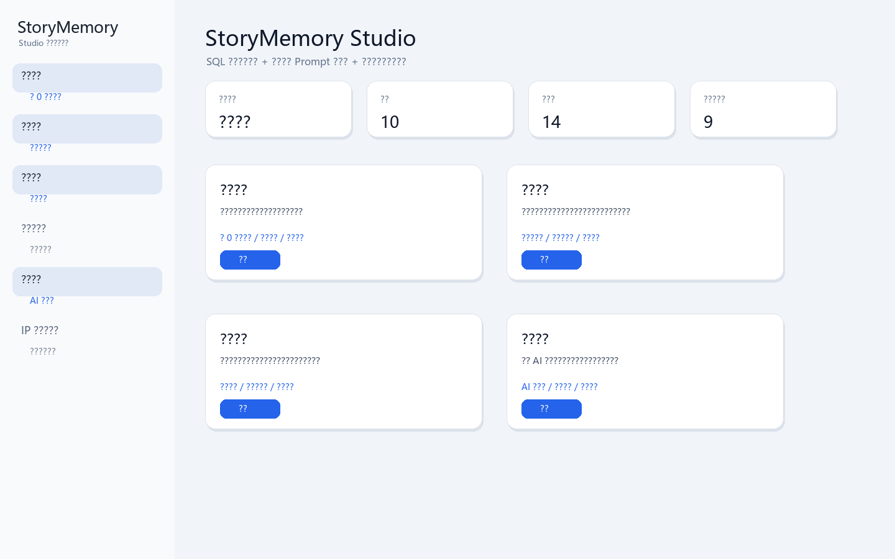
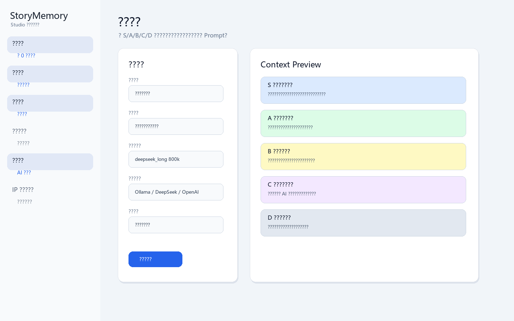
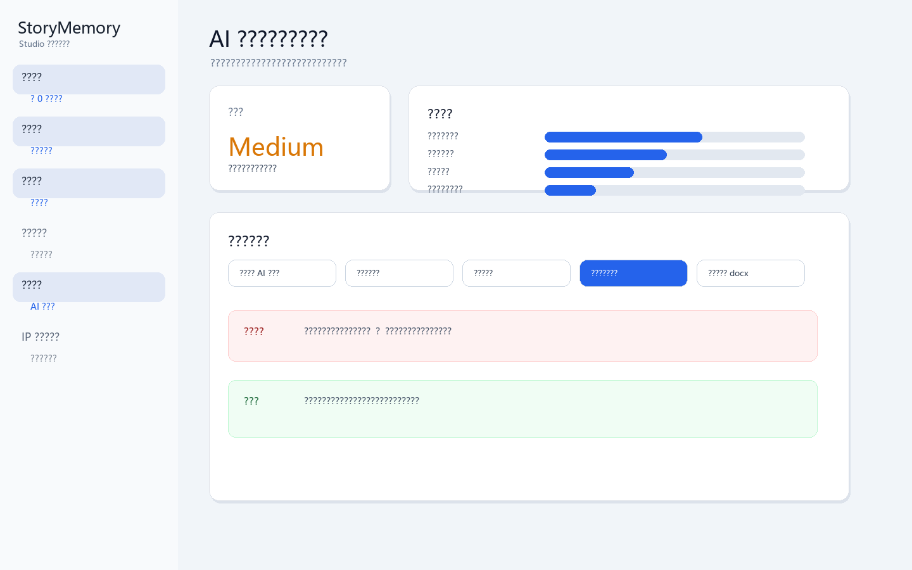

# StoryMemory Studio

**中文名：长篇记忆小说**

StoryMemory Studio is a local-first AI writing control center for long-form fiction and IP development. It combines a structured SQLite story memory database, long-context prompt orchestration, chapter generation, consistency checks, foreshadowing management, style profiling, AI-tone cleanup, novelization rewriting, and multi-format IP adaptation.

StoryMemory Studio 是一个本地优先的长篇小说与 IP 创作中控台。它不是“一键写小说”的玩具，而是把 **SQL 结构化记忆库、DeepSeek 百万 token 长上下文编排、章节生成、穿帮检测、伏笔管理、时间线管理、文风学习、AI 腔治理、小说化重写、IP 改编** 放进同一个可运行桌面工具里。

> Built for web novel authors, short drama writers, comic adaptation creators, and anyone who has watched a long story slowly forget its own rules.

> 面向网文作者、短剧编剧、漫画改编创作者，以及所有被“写到后期设定忘光了”折磨过的人。

---

## Download / 直接下载

Windows release:

[Download StoryMemoryStudio.exe](https://github.com/Jackeyhate9/StoryMemory-Studio/releases/download/v0.1.0/StoryMemoryStudio.exe)

Repository:

[https://github.com/Jackeyhate9/StoryMemory-Studio](https://github.com/Jackeyhate9/StoryMemory-Studio)

首次启动可能需要 10-30 秒。双击 exe 后会自动启动本地 Streamlit 界面并打开浏览器。若浏览器没有自动打开，请查看 exe 同级目录下的 `start_log.txt`。

Windows may warn about unsigned PyInstaller executables. This is expected for an unsigned MVP build. The app stores user data locally in `data/` and exports files to `exports/`.

---

## Interface Preview / 界面预览

> The screenshots below are UI previews generated from the current Streamlit layout. Actual project data depends on your local database.







---

## Why This Exists / 为什么需要它

Long fiction does not fail because an AI model cannot write one chapter. It fails because the system forgets:

- who knows which secret;
- which foreshadow was planted in chapter 12;
- whether a character was injured, missing, promoted, betrayed, or already reconciled;
- which rules must never be broken;
- what made the opening style work.

长篇创作的真正难点不是“写一章”，而是“写到第 50 章、第 100 章还能稳住”：

- 人物知道不该知道的信息；
- 伏笔埋了就再也没回收；
- 时间线、伤势、地点移动互相打架；
- 世界观规则前后矛盾；
- 文风越写越飘；
- 模型开始使用模板化总结句和 AI 腔结尾。

StoryMemory Studio treats memory as a first-class writing system:

- SQLite is the source of truth for facts, characters, relationships, rules, foreshadows, timelines, and logs.
- Long-context models are used deliberately, not by dumping the whole novel into the prompt.
- Context Builder ranks memory by priority, so the next chapter sees what matters most.
- Every generation is traceable, reviewable, editable, and exportable.

---

## DeepSeek Million-Token Strategy / DeepSeek 百万 Token 长上下文适配

StoryMemory Studio is designed for long-context models such as DeepSeek, but it does **not** simply paste the entire novel into the prompt.

DeepSeek 的长上下文能力非常适合做全局理解、长线一致性审查、伏笔回收和风格保持。但长上下文不等于“把全文粗暴塞进去”。StoryMemory Studio 采用 **SQL 结构化记忆库 + 分层 Prompt 编排**：

### Context Priority Layers / 上下文优先级

**Priority S: Current-task critical memory / 当前任务强相关**

- current chapter goal and outline;
- full character cards for appearing characters;
- current location, factions, props, abilities;
- active foreshadows;
- previous chapter full text or detailed summary;
- recent 3-5 chapter summaries;
- current volume outline.

**优先级 S：当前章节目标、章纲、出场人物完整人物卡、当前地点、相关伏笔、上一章全文或摘要、最近 3-5 章摘要、当前卷大纲。**

**Priority A: Hard constraints / 必须遵守的硬设定**

- world rules;
- ability system rules;
- forbidden contradictions;
- confirmed facts;
- key timeline nodes;
- character invariants.

**优先级 A：世界观硬规则、能力体系、时间线关键节点、人物不可违背设定、已确认事实、禁止出现的矛盾。**

**Priority B: Long-arc support / 长线辅助信息**

- main plot and side plot summaries;
- unresolved questions;
- relationship changes;
- item states;
- faction balance.

**优先级 B：主线、支线、未解决问题、人物关系变化、道具状态、势力格局。**

**Priority C: Style and platform adaptation / 风格与平台适配**

- style profile;
- pacing and dialogue style;
- target platform rules;
- anti-AI-tone constraints;
- recent AI-tone feedback.

**优先级 C：文风画像、叙事节奏、对话风格、爽点密度、目标平台风格、反 AI 腔规则。**

**Priority D: Compressed archive / 压缩背景信息**

- early chapter summary tree;
- whole-book synopsis;
- completed story overview;
- historical archive.

**优先级 D：早期章节摘要树、全书总纲、已完成剧情概览、历史归档信息。**

### Token Budget Modes / Token 预算模式

| Mode | Budget | Recommended use |
| --- | ---: | --- |
| `lite` | 32k | quick generation, small projects |
| `standard` | 128k | normal long-form writing |
| `deepseek_long` | 800k | DeepSeek long-context writing and consistency |
| `full_audit` | 1M | full-project audit, timeline and foreshadow review |

| 模式 | 预算 | 用途 |
| --- | ---: | --- |
| `lite` | 32k | 快速生成、小项目 |
| `standard` | 128k | 常规长篇创作 |
| `deepseek_long` | 800k | DeepSeek 长上下文创作与一致性保持 |
| `full_audit` | 1M | 全书审计、时间线、伏笔与设定总检查 |

### Why This Improves Recall / 为什么更容易命中关键设定

The goal is not to claim perfect recall. The goal is to increase the probability that the model sees the right fact at the right time.

StoryMemory Studio improves long-context hit rate by:

- using SQLite as the stable memory source;
- ranking memories before prompt construction;
- separating hard constraints from background lore;
- repeating high-risk constraints in clear headings;
- keeping recent chapter facts close to the generation task;
- feeding recent AI-tone and consistency reports back into the next prompt;
- using DeepSeek long context for global reasoning, not as a replacement for the database.

目标不是宣称“百分百不忘”，而是让模型在生成当前章节时更容易命中正确事实。系统通过结构化数据库、优先级召回、硬设定标题化、最近事实前置、质量反馈闭环来提高命中率。DeepSeek 的百万 token 能力用于全局理解和长线一致性，SQLite 仍然是事实来源。

---

## Core Features / 核心功能

- **Create Novel Wizard / 从 0 创建小说**  
  Generate a project Bible, world rules, character cards, relationships, foreshadows, timeline, first volume outline, first 10 chapter outlines, and first chapter draft from a small seed.

- **Story Memory Engine / 长篇记忆引擎**  
  Maintains structured memory for characters, facts, foreshadows, rules, timeline events, style profiles, forbidden rules, and unresolved questions.

- **Context Builder / 长上下文编排器**  
  Builds structured prompts using S/A/B/C/D priority layers instead of dumping raw text.

- **LLM Providers / 模型接入**  
  Supports DeepSeek, OpenAI-compatible APIs, OpenAI, and local Ollama models. Default release behavior prefers Ollama when available.

- **Style Profiler / 文风学习器**  
  Extracts abstract style profiles from pasted or uploaded samples. It does not copy protected text, unique metaphors, character names, or story events.

- **humanizer-zh Built In / 中文真人化处理**  
  Cleans model traces, template sentences, vague summaries, prompt leakage, `<think>` remnants, and obvious AI-flavored prose after generation.

- **AI Tone Detector / AI 腔检测器**  
  Separates real AI artifacts from acceptable light-novel expression, reports issue density, reader impact, and rewrite priority.

- **Novelization Rewriter / 小说化重写器**  
  Converts setting-card style chapters into scene-driven narrative with action, subtext, friction, objects, and concrete hooks.

- **Consistency Checker / 一致性检查器**  
  Checks character drift, timeline conflicts, item state errors, ability-system breaks, foreshadow misuse, and chapter goal completion.

- **IP Adaptation Matrix / IP 改编矩阵**  
  Converts chapters into comic storyboards, short drama scripts, AI video storyboards, Xiaohongshu posts, poster prompts, character cards, quotes, and teaser copy.

---

## Navigation / 界面导航

The UI is grouped into six primary sections:

1. **创作启动**: 从 0 创建小说、项目管理、章节导入
2. **记忆中枢**: 记忆库看板、记忆编辑器、备份与恢复
3. **章节创作**: 章节生成、章节编辑与导出、文风学习器、模型与数据设置
4. **一致性管理**: 一致性检查、伏笔管理、时间线管理、人物弧光追踪
5. **质量优化**: AI 腔检测、剧情节奏诊断、伏笔回收推荐、平台适配器
6. **IP 改编与分发**: 章节改编矩阵、漫画分镜、短剧脚本、小红书文案、海报/角色卡提示词

---

## Quick Start / 快速开始

### Windows release

1. Download `StoryMemoryStudio.exe` from the release page.
2. Double-click it.
3. Wait for the local page to open.
4. Go to **模型与数据设置** to configure Ollama, DeepSeek, or OpenAI-compatible APIs.
5. Create a project or import existing chapters.

### Local development

```powershell
python -m venv .venv
.\.venv\Scripts\activate
pip install -r requirements.txt
python run_ui.py
```

Run tests:

```powershell
python -m compileall app -q
python -m pytest -q
```

Build Windows exe:

```powershell
python build_exe.py
```

Output:

```text
dist/StoryMemoryStudio.exe
```

---

## Model Setup / 模型配置

Default local configuration:

```env
OLLAMA_BASE_URL=http://127.0.0.1:11434
DEFAULT_MODEL_PROVIDER=ollama
DEFAULT_OLLAMA_MODEL=auto
DEEPSEEK_API_KEY=
DEEPSEEK_BASE_URL=https://api.deepseek.com
OPENAI_COMPATIBLE_API_KEY=
OPENAI_COMPATIBLE_BASE_URL=
STORYMEMORY_DATA_DIR=./data
STORYMEMORY_EXPORT_DIR=./exports
```

Recommended local models:

```bash
ollama pull qwen3
ollama pull qwen2.5
ollama pull deepseek-r1
```

If Ollama is unavailable, configure DeepSeek or an OpenAI-compatible endpoint in the settings page.

---

## Typical Workflows / 推荐工作流

### New novel / 从 0 创建

1. 打开 **创作启动 / 从 0 创建小说**。
2. 输入标题、题材、平台、核心设定、主角、目标、爽点、禁忌内容和文风参考。
3. 生成小说 Bible。
4. 预览并编辑世界观、人物卡、伏笔、时间线、前 10 章章纲和第一章草稿。
5. 确认写入 Story Memory。
6. 使用 Context Builder 生成下一章。
7. 运行一致性检查、AI 腔检测和小说化重写。
8. 导出 docx。

### Existing novel / 导入已有作品

1. 创建或选择项目。
2. 导入 `txt`、`md` 或 `docx` 章节。
3. 抽取人物、事实、伏笔、时间线和世界观规则。
4. 在记忆库看板中审查并编辑。
5. 使用上下文构建器继续写后续章节。

### Quality loop / 质量优化闭环

1. 生成章节。
2. 运行 AI 腔检测。
3. 对高风险段落执行句子修复、段落润色或小说化重写。
4. 保存为新版本。
5. 把高频 AI 腔问题反馈给下一章 Context Builder。

---

## Architecture / 架构

```text
Novel seed / imported chapters / user edits
                |
                v
        Memory Extractor
                |
                v
 SQLite Story Memory Database
                |
                v
        Context Builder
  S / A / B / C / D priority layers
                |
                v
 DeepSeek / OpenAI-compatible / OpenAI / Ollama
                |
                v
 Chapter Generator
                |
                v
 Output Cleaner -> humanizer-zh -> Novelization Rewriter
                |
                v
 Consistency Checker / AI Tone Detector / Pacing Analyzer
                |
                v
 Memory Update + Logs + Export
```

---

## Data Safety / 数据安全

StoryMemory Studio is local-first:

- project database: `data/`
- exported files: `exports/`
- model configuration: `.env`
- startup logs: `start_log.txt`
- no project data is uploaded by default
- `.env`, `data/`, `exports/`, `backups/`, `dist/`, and `.venv/` are ignored by git

发布版不会把用户数据库写入 PyInstaller 临时目录。数据库、导出文件和配置文件都默认保存在 exe 同级目录。

---

## CLI Examples / CLI 示例

```powershell
python -m app.cli init --name demo --title 我的小说
python -m app.cli import-chapter demo ./chapter1.txt --number 1 --title 第一章 --provider none
python -m app.cli build-context demo 2 --goal 推进主线 --mode standard
python -m app.cli detect-ai-tone --project-id 1 --chapter-id 1
python -m app.cli novelize-chapter --project-id 1 --chapter-id 1 --save-as-new-version true
python -m app.cli adapt-chapter --project-id 1 --chapter-id 1 --type all
python -m app.cli export-docx --project-id 1 --output exports/my_novel.docx
```

---

## Release Package / 发布包结构

```text
dist/
├── StoryMemoryStudio.exe
├── data/
├── exports/
├── prompts/
├── .env
├── .env.example
├── README.md
├── README_使用说明.md
├── schema.sql
└── start_log.txt
```

---

## Current MVP Status / 当前状态

Working MVP:

- grouped Chinese Streamlit UI;
- local SQLite database initialization;
- Create Novel Wizard;
- chapter import and generation;
- Story Memory dashboard and editor;
- context builder with long-context budget modes;
- DeepSeek, OpenAI-compatible, OpenAI, and Ollama connectors;
- style profiler and humanizer-zh integration;
- AI tone detector and novelization rewriter;
- docx export;
- PyInstaller Windows launcher.

Known TODO:

- `.doc` import depends on the local Windows environment; `txt`, `md`, and `docx` are the stable paths.
- Release exe is not code-signed yet.
- Advanced quality scoring is an MVP heuristic plus LLM-assisted workflow; future versions can add benchmark datasets.

---

## One-Line Pitch / 一句话

**A local-first AI writing control center for long-form fiction: structured story memory, DeepSeek-ready long-context orchestration, consistency checks, AI-tone cleanup, and IP adaptation.**

**一个本地优先的长篇小说 AI 创作中控台：结构化记忆、DeepSeek 百万 token 长上下文编排、一致性检查、AI 腔治理与 IP 改编。**
